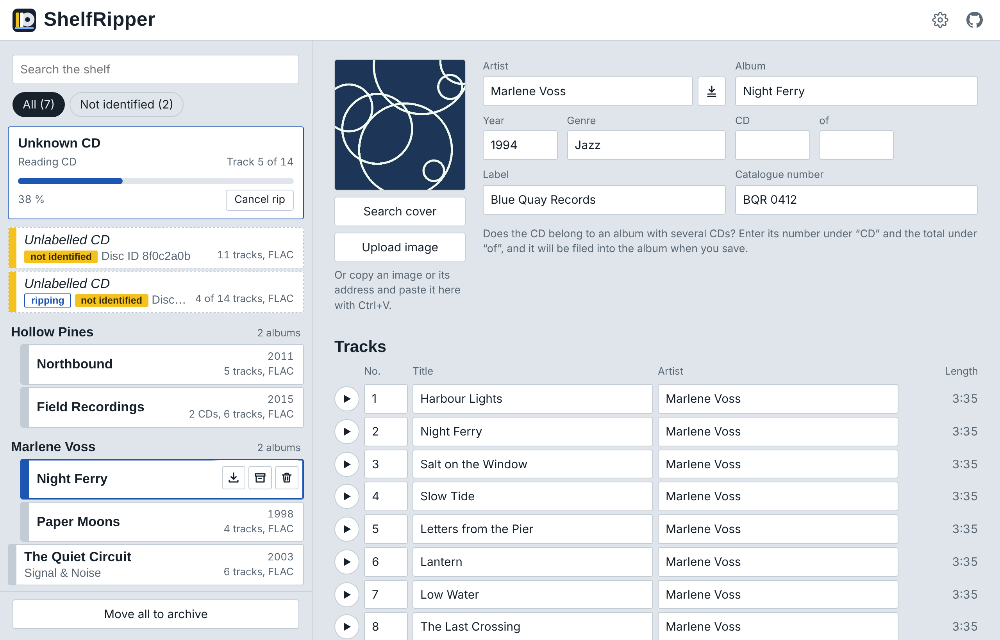
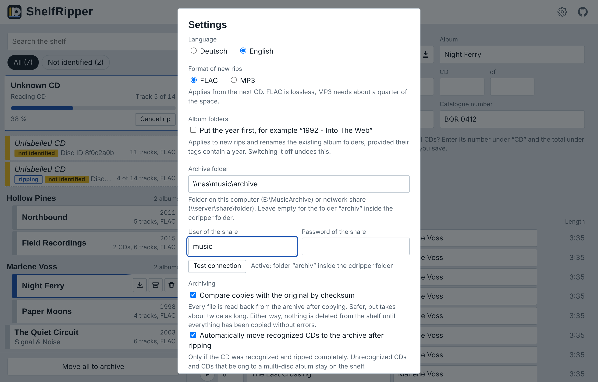

#  ShelfRipper

**Insert a CD, get a tagged album.** Two small Docker containers: one rips every audio CD you put in the drive, the other gives you a web page to check, tag and archive the results. Runs on Windows (Docker Desktop) and on Debian, including Debian in a Proxmox LXC container.

[Deutsche Fassung](README.de.md)



*The albums in the screenshots are made up.*

## What it does

- **Rips automatically.** Put a CD in, it is read with error correction (cdparanoia), saved as FLAC or MP3, and ejected.
- **Looks the CD up on MusicBrainz.** CDs it does not know are flagged on the shelf.
- **Tags from Discogs.** Search for the release, compare track lengths, take over artist, titles, year, label and catalogue number. The choice is remembered per disc: rip the same CD again and it is tagged from Discogs straight away.
- **Covers.** Fetched automatically from the [Cover Art Archive](https://coverartarchive.org/) after each recognized rip; otherwise search via [COV](https://covers.musichoarders.xyz/), upload a file, or paste an image.
- **Multi-disc albums** are kept as `Artist/Album/CD1`, `CD2`, … and shown as one album. Drag a CD onto an album to add it.
- **Live progress** with track count, and a button to cancel the rip and eject the disc.
- **Archive.** Move finished albums to a local folder or an SMB share, optionally verified by SHA-256, one by one, all at once, or automatically after each recognized rip. Switch the album list between **Shelf | Archive** to browse, play, re-tag, download, delete or bring back albums that are already archived; the archive is indexed in a small database (`config/archive.db`).
- **Download as ZIP or delete** right from the album list, play buttons per track, optional year prefix for album folders (`1992 - Album`), English and German interface.

## Installation on Windows

You need:

- Windows 10/11 (x64) with [Docker Desktop](https://www.docker.com/products/docker-desktop/) using the WSL2 backend
- A USB CD/DVD drive
- [usbipd-win](https://github.com/dorssel/usbipd-win), which hands the USB drive to WSL2

Then:

1. Download or clone this repository, for example to `D:\Docker\shelfripper`.
2. Connect the drive and double-click **`start.bat`**. It asks for administrator rights, lists the USB devices, and asks for the BUSID of the drive (for example `2-3`). Then it builds and starts both containers. The first build takes a few minutes.
3. Open <http://localhost:8080>.
4. Insert a CD.

After a reboot or after re-plugging the drive, run `start.bat` again so the drive is handed to WSL2 again.

| File | Purpose |
| --- | --- |
| `start.bat` | Hands the drive to WSL2 and starts everything |
| `start-web.bat` | Rebuilds only the web page; a running rip is not disturbed |
| `update.bat` | Rebuilds both containers; run it only when no CD is being ripped |

## Installation on Debian

You need Docker with the Compose plugin and git, and a CD/DVD drive that shows up as `/dev/sr0`:

```
ls -l /dev/sr0
```

Then:

```
git clone https://github.com/stobiaskoch/shelfripper.git
cd shelfripper
cp .env.example .env
docker compose up -d --build
```

Open `http://<server>:8080` and insert a CD.

- **`.env`:** `WEB_BIND=0.0.0.0` makes the web page reachable from your whole network (it has no login). Use `WEB_PORT` if port 8080 is already taken.
- **Permissions:** if `docker` says "permission denied", add your user to the `docker` group (`sudo usermod -aG docker $USER`, then log in again) or use `sudo`.
- **Updating:** `git pull && docker compose up -d --build`, ideally while no CD is being ripped. `docker compose up -d --build web` updates only the web page.
- **Re-plugging the drive:** the ripper gets `/dev/sr0` when it starts, so run `docker compose restart cdripper` afterwards.
- **Local archive folder:** set `ARCHIVE_DIR=/path/to/archive` in `.env` and run `docker compose up -d`. An SMB share is set in the web page as on Windows.

### Debian in a Proxmox LXC container

Docker inside an LXC container does not see the USB drive on its own: the container shows the drive in `lsblk`, but `/dev/sr0` is missing. Pass it through on the **Proxmox host** (replace `105` with your container ID):

```
pct set 105 -dev0 /dev/sr0 -dev1 /dev/sg0
pct reboot 105
```

or in the Proxmox web UI: container → *Resources* → *Add* → *Device Passthrough*. On Proxmox versions before 8.1, add these lines to `/etc/pve/lxc/105.conf` instead and restart the container:

```
lxc.cgroup2.devices.allow: c 11:0 rwm
lxc.cgroup2.devices.allow: c 21:0 rwm
lxc.mount.entry: /dev/sr0 dev/sr0 none bind,optional,create=file
lxc.mount.entry: /dev/sg0 dev/sg0 none bind,optional,create=file
```

Check the device numbers with `ls -l /dev/sr0 /dev/sg*` on the host; `sg0` may be a different number if the host has other SCSI devices. The container also needs Docker support (`nesting=1`, usually `keyctl=1` for unprivileged containers). Ejecting works there too: when the normal `eject` fails, the ripper sends the eject command to the drive directly.

## Settings



- **Format:** FLAC or MP3 (LAME V0). Applies from the next CD.
- **Discogs token:** free, created at [discogs.com/settings/developers](https://www.discogs.com/settings/developers) with "Generate new token". It is checked when you save.
- **Archive folder:** a folder on the PC (`E:\MusicArchive`) or a network share (`\\server\share\folder`) with user and password. A local folder takes effect after running `update.bat` once; a share works immediately. If the server name cannot be resolved from inside the container, use its IP address. On Linux, set a local archive folder in `.env` (see above).

## Where things are stored

| Folder | Content |
| --- | --- |
| `musik/` | The ripped albums: `Artist/Album/01 - Title.flac` |
| `archiv/` | Default archive folder |
| `config/` | `settings.json`, the remembered Discogs releases `discogs-cds.json` and the log `web.log` |

`config/settings.json` contains the Discogs token and the share password **in plain text**. The folder is excluded from Git; do not share it.

## Good to know

- By default the web page is only reachable from the machine itself (`127.0.0.1:8080`); `WEB_BIND` in `.env` opens it to the network. It has no login, so only do that in a network you trust, and never expose it to the internet.
- Lookups go to MusicBrainz, the Cover Art Archive and Discogs. Cover search opens COV in a separate window.
- On Windows, directory renames can fail while Explorer or a player has the folder open. The app retries later.
- Only rip CDs you are allowed to copy under the law that applies to you.

## How it is built

- `Dockerfile`, `rip.sh`, `abcde.conf`: the ripper, Debian with [abcde](https://abcde.einval.com/), cdparanoia, flac and lame. `rip.sh` polls the drive and reports progress in `musik/.cdripper/status.json`.
- `web/`: the web page, Python with Flask and mutagen in one file (`app.py`), and one HTML file without a build step.

## License

MIT, see [LICENSE](LICENSE).
