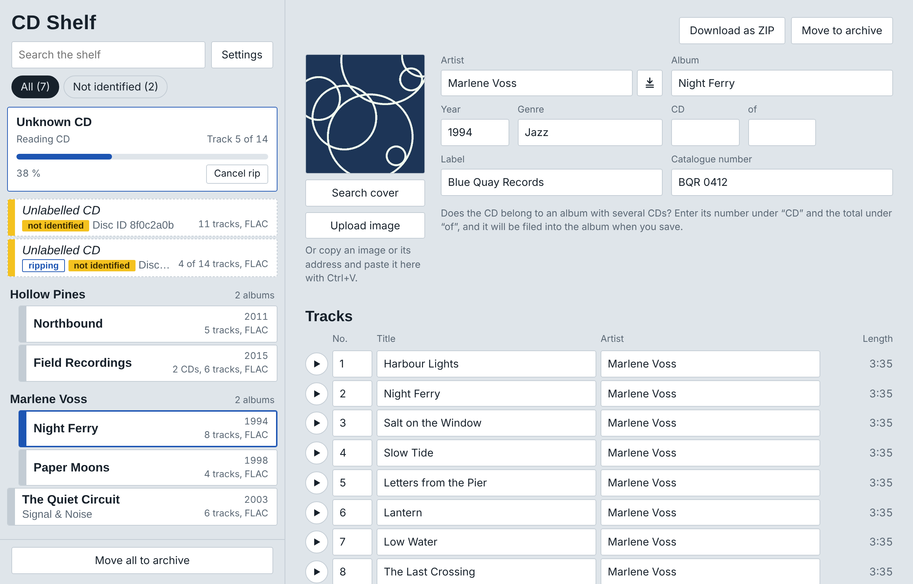

#  Shelfripper

**Insert a CD, get a tagged album.** Two small Docker containers for Windows: one rips every audio CD you put in the drive, the other gives you a web page to check, tag and archive the results.

[Deutsche Fassung](README.de.md)

*The albums in the screenshots are made up.*

## What it does

- **Rips automatically.** Put a CD in, it is read with error correction (cdparanoia), saved as FLAC or MP3, and ejected.
- **Looks the CD up on MusicBrainz.** CDs it does not know are flagged on the shelf.
- **Tags from Discogs.** Search for the release, compare track lengths, take over artist, titles, year, label and catalogue number.
- **Covers.** Search via [COV](https://covers.musichoarders.xyz/), upload a file, or paste an image.
- **Multi-disc albums** are kept as `Artist/Album/CD1`, `CD2`, … and shown as one album. Drag a CD onto an album to add it.
- **Live progress** with track count, and a button to cancel the rip and eject the disc.
- **Archive.** Move finished albums to a local folder or an SMB share, optionally verified by SHA-256, one by one, all at once, or automatically after each recognized rip.
- **Download as ZIP**, play buttons per track, optional year prefix for album folders (`1992 - Album`), English and German interface.

## Requirements

- Windows 10/11 (x64) with [Docker Desktop](https://www.docker.com/products/docker-desktop/) using the WSL2 backend
- A USB CD/DVD drive
- [usbipd-win](https://github.com/dorssel/usbipd-win), which hands the USB drive to WSL2

It should also run on Linux with `docker compose up -d --build` if the drive is `/dev/sr0`; the `.bat` files are Windows only. This has not been tested.

## Getting started

1. Download or clone this repository, for example to `D:\Docker\shelfripper`.
2. Connect the drive and double-click **`start.bat`**. It asks for administrator rights, lists the USB devices, and asks for the BUSID of the drive (for example `2-3`). Then it builds and starts both containers. The first build takes a few minutes.
3. Open <http://localhost:8080>.
4. Insert a CD.

After a reboot or after re-plugging the drive, run `start.bat` again so the drive is handed to WSL2 again.

| File | Purpose |
| --- | --- |
| `start.bat` | Hands the drive to WSL2 and starts everything |
| `start-web.bat` | Rebuilds only the web page; a running rip is not disturbed |
| `update.bat` | Rebuilds both containers; run it only when no CD is being ripped |

## Settings

- **Format:** FLAC or MP3 (LAME V0). Applies from the next CD.
- **Discogs token:** free, created at [discogs.com/settings/developers](https://www.discogs.com/settings/developers) with "Generate new token". It is checked when you save.
- **Archive folder:** a folder on the PC (`E:\MusicArchive`) or a network share (`\\server\share\folder`) with user and password. A local folder takes effect after running `update.bat` once; a share works immediately. If the server name cannot be resolved from inside the container, use its IP address.

## Where things are stored

| Folder | Content |
| --- | --- |
| `musik/` | The ripped albums: `Artist/Album/01 - Title.flac` |
| `archiv/` | Default archive folder |
| `config/` | `settings.json` and the log `web.log` |

`config/settings.json` contains the Discogs token and the share password **in plain text**. The folder is excluded from Git; do not share it.

## Good to know

- The web page is only reachable from the PC itself (`127.0.0.1:8080`). It has no login, so do not expose it to a network as it is.
- Lookups go to MusicBrainz and Discogs. Cover search opens COV in a separate window.
- Directory renames can fail while Windows Explorer or a player has the folder open. The app retries later.
- Only rip CDs you are allowed to copy under the law that applies to you.

## How it is built

- `Dockerfile`, `rip.sh`, `abcde.conf`: the ripper, Debian with [abcde](https://abcde.einval.com/), cdparanoia, flac and lame. `rip.sh` polls the drive and reports progress in `musik/.cdripper/status.json`.
- `web/`: the web page, Python with Flask and mutagen in one file (`app.py`), and one HTML file without a build step.

## License

MIT, see [LICENSE](LICENSE).
